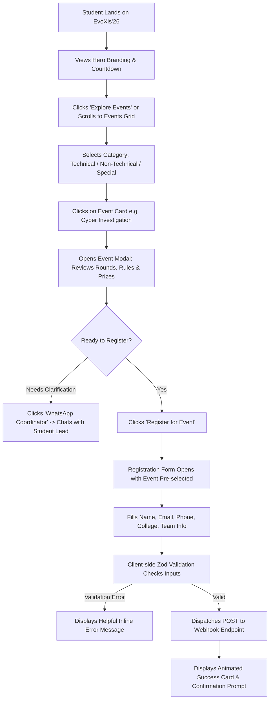
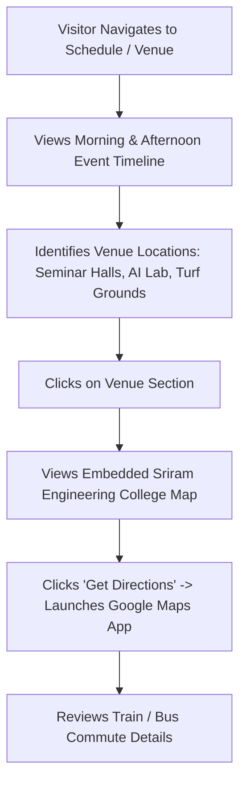
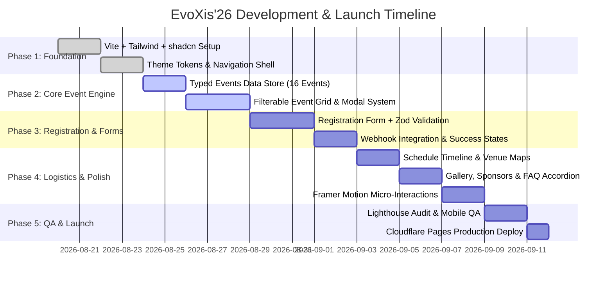

# EvoXis'26 — Product Requirements Document (PRD)

**Product Name:** EvoXis'26 Official Web Portal  
**Document Version:** 1.0.0  
**Status:** Ready for Review & Implementation  
**Product Lead:** BMad Product Manager Persona (John) & College Web Development Council  
**Host Institution:** Sriram Engineering College  
**Joint Host Departments:** CSBS, CSE, AI&DS, AIML, Cyber Security  
**Symposium Tagline:** *"Evolving Intelligence • Infinite Possibilities"*  

---

## 1. Problem Statement

Every academic year, Sriram Engineering College conducts its flagship national technical symposium, bringing together thousands of engineering and technology students across South India. In previous editions, symposium communication and registration suffered from:
1. **Fragmented Promotional Channels:** Information scattered across Instagram flyers, PDF rulebooks, and multiple WhatsApp groups led to student confusion regarding eligibility, team sizes, and event timings.
2. **Registration Friction & Data Discrepancy:** Multiple informal Google Forms distributed by individual departments led to duplicate entries, mismatched team rosters, and significant manual overhead for student coordinators.
3. **Subpar Mobile Experience:** Static posters and unoptimized links created high drop-off rates for mobile users looking for quick information about events, cash prizes, and location access.

### The Solution: EvoXis'26 Web Portal
A unified, ultra-fast, visually stunning, mobile-first static web portal that serves as the single source of truth for **EvoXis'26**. It showcases all 16 events across 5 host departments with interactive search/filtering, comprehensive rulebooks, direct coordinator WhatsApp access, and an integrated, zero-friction registration workflow.

---

## 2. Goals & Success Metrics

### Primary Goals
- **Maximize Participant Ingestion:** Achieve seamless registration for 1,500+ student participants across the 16 events.
- **Deliver an Exceptional First Impression:** Provide a futuristic "wow" factor through neon cybernetic aesthetics, glassmorphism, and fluid Framer Motion animations that elevate Sriram Engineering College's technical brand.
- **Zero Friction & High Reliability:** Guarantee 100% uptime with zero server maintenance costs and instant sub-1.5s page loads over mobile 4G networks.

### Success Metrics (KPIs)
| Metric | Baseline (Past Events) | Target for EvoXis'26 | Measurement Method |
|---|---|---|---|
| **Registration Conversion Rate** | ~6% | **≥ 18%** of unique visitors | Submissions / Unique Visitors |
| **Mobile Page Load Speed (LCP)** | 4.2s (Heavy PDF/Forms) | **< 1.5s** | Google PageSpeed / Lighthouse |
| **Mobile Traffic Handling Share** | 65% | **> 80%** | Cloudflare / GA4 Analytics |
| **Form Drop-off Rate** | 38% (Lengthy forms) | **< 10%** | Step Completion Analytics |
| **Total Event Registrations** | ~600 | **1,500+ participants** | Registration Ingestion DB |

### Counter-Metrics (Guards Against Adverse Trade-offs)
- **Zero Server Hosting Costs:** Must maintain $0/month infrastructure cost by leveraging Cloudflare Pages static CDN edge and serverless webhooks.
- **Zero Coordinator Bottlenecks:** Direct WhatsApp links per event ensure coordinators do not experience email delays for rapid participant Q&A.

---

## 3. Target Users & Personas

### Persona 1: Rahul — The Competitive Tech Participant
- **Profile:** 3rd Year B.Tech AI&DS student from a neighboring engineering college.
- **Behavior:** Browses symposium links on Instagram while commuting via train. Uses a mid-range smartphone on 4G.
- **Pain Points:** Hates downloading 10 MB PDF brochures to check rules; needs to know team sizes and prize pools in under 30 seconds.
- **Desired Outcome:** Instantly filters technical events, reviews "Paper Presentation" and "Cyber Investigation" rules, forms a team, and registers on the spot.

### Persona 2: Priya — Student Event Coordinator
- **Profile:** Final Year CSBS student coordinating the "Business Battle" event.
- **Behavior:** Needs to answer participant rule questions, verify participant eligibility, and access clean registration rosters without cross-departmental confusion.
- **Pain Points:** Tired of fielding redundant phone calls asking basic schedule or venue questions.
- **Desired Outcome:** All event rules, deadlines, venues, and timings are crisply documented on the event card, and participants reach out with context via pre-filled WhatsApp links.

### Persona 3: Prof. K. Ramanathan — Faculty Department Head
- **Profile:** Senior Faculty representing the 5 co-hosting departments (CSBS, CSE, AI&DS, AIML, Cyber Security).
- **Behavior:** Reviews overall symposium presentation, sponsor visibility, institutional dignity, and schedule alignment.
- **Pain Points:** Wants all 5 departments equally highlighted with high professional standard and clear academic credentials.
- **Desired Outcome:** A polished, modern portal reflecting college excellence, highlighting guest dignitaries, sponsors, and campus hospitality.

---

## 4. Scope & Boundaries

### In-Scope (v1 Launch Target)
- Modern Responsive Landing page with Hero countdown timer, symposium branding, and theme showcase.
- 5 Host Departments Co-Branding section with mission statements and HOD highlights.
- Filterable 16-event interactive catalog with category tabs (Technical, Non-Technical, Special).
- Deep-dive Event Modals with exhaustive rules, rounds, team sizes, prize breakdown, and coordinator contacts.
- Integrated, multi-step participant registration modal/form with real-time validation and webhook transmission.
- Interactive Day Schedule & Timeline filterable by venue and time slots.
- Campus Venue locator with Google Maps integration, railway/bus transit guides.
- High-resolution Past Event Photo Highlights Gallery and Sponsor/Partner Grid.
- Expandable General FAQs and department credit footer.

### Explicitly Out-of-Scope (v1)
- Custom user login accounts, password authentication, or participant profile portals.
- On-platform real-time online code execution / online judge.
- Automated instant digital certificate generator (deferred to post-event script).
- Native payment gateway API reconciliation (UPI transaction ID / on-spot payment model used instead).
- Dynamic CMS or admin dashboard (all event data statically managed in `src/data/events.ts`).

---

## 5. Feature List & MoSCoW Prioritization

```
========================================================================================
                             MOSCOW FEATURE MATRIX
========================================================================================
```

| Priority | Feature ID | Feature Name | Description & Acceptance Criteria |
|---|---|---|---|
| **Must Have (P0)** | **F-01** | **Hero Section & Countdown** | High-impact visual branding with live ticking countdown to symposium date (Days, Hours, Mins, Secs). |
| **Must Have (P0)** | **F-02** | **16-Event Filterable Grid** | Instant category switching (All, Technical, Non-Technical, Special) with responsive cards. |
| **Must Have (P0)** | **F-03** | **Event Detail Modals** | Accessible popup detailing rules, rounds, team size, prizes, coordinator phone/WhatsApp links. |
| **Must Have (P0)** | **F-04** | **Registration Flow** | Smooth client-validated form capturing student info, college, event, team members with loading & success states. |
| **Must Have (P0)** | **F-05** | **Mobile Navigation Drawer** | Accessible hamburger navigation with smooth scroll to page sections. |
| **Must Have (P0)** | **F-06** | **Schedule Timeline** | Chronological timeline displaying event slots, venues, and keynote times. |
| **Must Have (P0)** | **F-07** | **Venue & Transit Guide** | Google Maps coordinate card, railway station directions, bus route assistance. |
| **Should Have (P1)** | **F-08** | **Direct WhatsApp Coordinator Link** | Pre-filled WhatsApp message generator (`https://wa.me/...`) for instant participant-to-coordinator chat. |
| **Should Have (P1)** | **F-09** | **Event Search Filter** | Live client-side text search querying event titles and descriptions. |
| **Should Have (P1)** | **F-10** | **Past Event Gallery** | Visual photo showcase grid with responsive WebP image optimization. |
| **Should Have (P1)** | **F-11** | **Sponsors & Partner Grid** | Tiered logo display honoring industry sponsors and media partners. |
| **Should Have (P1)** | **F-12** | **FAQs Accordion** | Expandable answers to common questions (food, transport, certificates, rules). |
| **Could Have (P2)** | **F-13** | **Add to Calendar (ICS)** | One-click button to add EvoXis'26 to Google Calendar or Apple Calendar. |
| **Could Have (P2)** | **F-14** | **Audio / Theme FX Toggle** | Subtle cybernetic ambient UI sounds / particles toggle. |
| **Won't Have (v1)** | **F-15** | **User Accounts & Login** | Deferred — not required for static symposium registration. |
| **Won't Have (v1)** | **F-16** | **Live Scoreboard / Leaderboard** | Deferred — managed offline by event judges on symposium day. |

---

## 6. User Flows

### Flow 1: Event Discovery & Instant Registration (Primary Flow)



### Flow 2: Schedule Exploration & Campus Venue Navigation



---

## 7. Design Direction & UX Strategy

### 7.1 Visual Tone & Theme
- **Theme Concept:** *Neo-Cybernetic Intelligence* — blending high-tech AI symbolism with clean, modern readability.
- **Color Palette:**
  - Background Dark Base: `#080C15` / `#0D111D` (Deep Cyber Obsidian)
  - Card & Modal Glass: `rgba(17, 24, 39, 0.75)` with `backdrop-blur-xl` and `border-cyan-500/20`
  - Primary Accent: `#00F2FE` (Electric Cyber Cyan)
  - Secondary Accent: `#9333EA` / `#C084FC` (Neon Electric Violet / AI Purple)
  - Text & Accents: Pure White `#FFFFFF`, Slate Muted `#94A3B8`
- **Typography:**
  - Display / Headings: `Outfit` (Bold, futuristic, geometric sans-serif)
  - Body / Form Inputs: `Inter` (Crisp, highly legible at small mobile scales)

### 7.2 Multi-Department Co-Branding
A dedicated badge strip acknowledging the collaborative leadership of all 5 departments:
1. Computer Science and Business Systems (CSBS)
2. Computer Science and Engineering (CSE)
3. Artificial Intelligence & Data Science (AI&DS)
4. Artificial Intelligence and Machine Learning (AIML)
5. Cyber Security

---

## 8. Milestones & Implementation Roadmap



---

## 9. Risks, Assumptions & Open Questions

### Open Questions
> **Open Question 1 [Registration Ingestion Method]:** What is the college team's preferred intake destination for registrations?  
> - *Option A (Default Recommended):* A Cloudflare Pages Function `/api/register` posting directly into a designated Google Sheet via Service Account or Supabase database table.  
> - *Option B:* Direct client-side POST to a webhook service (e.g. Formspree / Make.com / Google Apps Script Web App).  
> *Decision Required from Team:* Confirm the target webhook endpoint URL or provide Google Sheet credentials prior to live production deployment.

### Key Assumptions
> **Assumption 1:** Registration entry fee structure (if any) is collected via UPI QR code embedded directly inside the registration modal, and the participant enters their 12-digit UPI reference number.  
> **Assumption 2:** All 16 events will run simultaneously or sequentially according to the static master schedule without needing dynamic live-rescheduling controls during the event.

### Risk Mitigation Strategy
- **Risk: Event rules or coordinator phone numbers change close to symposium date.**  
  *Mitigation:* All 16 events are defined in a clean, typed configuration file (`src/data/events.ts`). Any change requires updating only 2 lines of JSON and pushing to GitHub; Cloudflare Pages auto-deploys within 45 seconds.
- **Risk: Network throttling on participant phones during peak campus hours.**  
  *Mitigation:* Aggressive asset compression (AVIF/WebP), lazy loading of gallery images, and zero external blocking JavaScript ensure the page remains snappy even on 2G/3G connections.

---

## 10. Out of Scope (Deferred to v2)
1. **Dynamic Admin Content Editor:** Managing event text via a full-blown CMS.
2. **On-spot Barcode / QR Ticket Check-In:** Scanner app for event volunteers at the gate.
3. **Automated Merit / Participation Certificate PDF Generator.**
