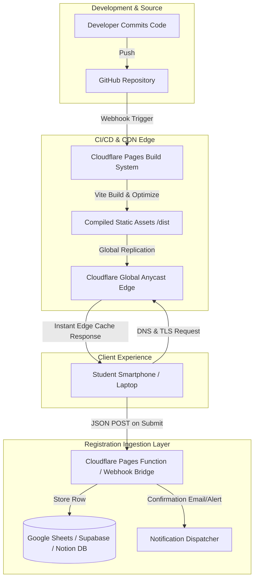

# EvoXis'26 — Software Requirements Specification (SRS)

**Project Name:** EvoXis'26  
**Document Version:** 1.0.0  
**Status:** Approved Specification  
**Organizer:** Sriram Engineering College  
**Host Departments:** Computer Science and Business Systems (CSBS), Computer Science and Engineering (CSE), Artificial Intelligence & Data Science (AI&DS), Artificial Intelligence and Machine Learning (AIML), Cyber Security  
**Tagline:** *"Evolving Intelligence • Infinite Possibilities"*  
**Author:** Technical Architecture & Product Engineering Team (BMad Suite)

---

## Table of Contents

- [1. Introduction](#1-introduction)
  - [1.1 Purpose](#11-purpose)
  - [1.2 Scope](#12-scope)
  - [1.3 Definitions, Acronyms, and Abbreviations](#13-definitions-acronyms-and-abbreviations)
  - [1.4 References](#14-references)
  - [1.5 Document Overview](#15-document-overview)
- [2. Overall Description](#2-overall-description)
  - [2.1 Product Perspective](#21-product-perspective)
  - [2.2 Product Functions](#22-product-functions)
  - [2.3 User Classes and Characteristics](#23-user-classes-and-characteristics)
  - [2.4 Operating Environment](#24-operating-environment)
  - [2.5 Design and Implementation Constraints](#25-design-and-implementation-constraints)
  - [2.6 Assumptions and Dependencies](#26-assumptions-and-dependencies)
- [3. Functional Requirements](#3-functional-requirements)
  - [3.1 Navigation & Presentation](#31-navigation--presentation)
  - [3.2 Event Discovery & Details](#32-event-discovery--details)
  - [3.3 Registration & Ingestion](#33-registration--ingestion)
  - [3.4 Schedule, Venue & Logistics](#34-schedule-venue--logistics)
  - [3.5 Media, Sponsorship & Social Telemetry](#35-media-sponsorship--social-telemetry)
- [4. Non-Functional Requirements](#4-non-functional-requirements)
  - [4.1 Performance & Core Web Vitals](#41-performance--core-web-vitals)
  - [4.2 Scalability & Concurrent Load Handling](#42-scalability--concurrent-load-handling)
  - [4.3 Accessibility (a11y)](#43-accessibility-a11y)
  - [4.4 Security & Data Hygiene](#44-security--data-hygiene)
  - [4.5 Device & Browser Compatibility](#45-device--browser-compatibility)
  - [4.6 Maintainability & Code Quality](#46-maintainability--code-quality)
- [5. System Architecture](#5-system-architecture)
  - [5.1 Static-Site Edge Architecture](#51-static-site-edge-architecture)
  - [5.2 Rationale for Zero Dedicated Backend](#52-rationale-for-zero-dedicated-backend)
  - [5.3 Registration Data-Handling Boundary](#53-registration-data-handling-boundary)
- [6. Data Requirements](#6-data-requirements)
  - [6.1 Event Data Model](#61-event-data-model)
  - [6.2 Registration Submission Model](#62-registration-submission-model)
  - [6.3 Department & Contact Data Model](#63-department--contact-data-model)
- [7. External Interface Requirements](#7-external-interface-requirements)
  - [7.1 Client-Side User Interfaces](#71-client-side-user-interfaces)
  - [7.2 Software & Service Interfaces](#72-software--service-interfaces)
  - [7.3 Communication Interfaces](#73-communication-interfaces)
- [8. Appendix](#8-appendix)
  - [8.1 Complete Events Catalog (16 Events)](#81-complete-events-catalog-16-events)
  - [8.2 Glossary of Terms](#82-glossary-of-terms)

---

## 1. Introduction

### 1.1 Purpose
This Software Requirements Specification (SRS) defines the complete functional, non-functional, data, and architectural requirements for the **EvoXis'26** college symposium web application. It serves as the single source of truth for the student developers, designers, faculty coordinators, and deployment engineers at Sriram Engineering College.

### 1.2 Scope
The EvoXis'26 web portal is a high-performance, responsive, static single-page web application (SPA) distributed across a global Content Delivery Network (CDN). The application serves as the primary digital promotional channel, authoritative event catalog (16 events across Technical, Non-Technical, and Special tracks), timeline coordinator, and participant registration gateway for the inter-collegiate national symposium.

### 1.3 Definitions, Acronyms, and Abbreviations
| Term / Acronym | Definition |
|---|---|
| **SRS** | Software Requirements Specification |
| **PRD** | Product Requirements Document |
| **SPA** | Single Page Application |
| **CDN** | Content Delivery Network (specifically Cloudflare Global Edge) |
| **CTA** | Call to Action (e.g., "Register Now", "View Rules") |
| **FR** | Functional Requirement |
| **NFR** | Non-Functional Requirement |
| **SSG** | Static Site Generation |
| **WCAG** | Web Content Accessibility Guidelines (2.1 Level AA) |
| **LCP** | Largest Contentful Paint (Core Web Vital metric) |
| **CLS** | Cumulative Layout Shift (Core Web Vital metric) |
| **INP** | Interaction to Next Paint (Core Web Vital metric) |
| **CSBS** | Computer Science and Business Systems |
| **AI&DS** | Artificial Intelligence & Data Science |
| **AIML** | Artificial Intelligence and Machine Learning |
| **CSE** | Computer Science and Engineering |

### 1.4 References
1. IEEE Std 830-1998 — Recommended Practice for Software Requirements Specifications.
2. W3C Web Content Accessibility Guidelines (WCAG) 2.1 Level AA.
3. React 18 / 19 Core Documentation (`react.dev`).
4. Vite Build Engine Documentation (`vite.dev`).
5. Tailwind CSS v3/v4 Styling Framework Specification (`tailwindcss.com`).
6. Cloudflare Pages Platform Architecture & Edge Workers Specification (`developers.cloudflare.com/pages`).

### 1.5 Document Overview
This document is organized into eight logical sections following industry standard software engineering guidelines. Sections 2 through 4 detail operational context, functional behaviors, and qualitative boundaries. Sections 5 through 7 detail architecture, schemas, and integration contracts. Section 8 provides the complete event roster and glossary.

---

## 2. Overall Description

### 2.1 Product Perspective
EvoXis'26 replaces fragmented social-media-only campaigns with a centralized, mobile-first web hub. The site operates in a decentralized Jamstack paradigm: modern React components built to pre-rendered static HTML, JavaScript, CSS, and optimized media assets, pushed directly to Cloudflare Pages edge storage.

```
[ Developer / GitHub ] ---> [ Cloudflare Pages CI/CD ] ---> [ Global Cloudflare Edge CDN ]
                                                                       |
                                                               (Fast TLS 1.3)
                                                                       v
                                                           [ Student Mobile / Desktop ]
```

### 2.2 Product Functions
- **Hero & Countdown:** High-impact symposium branding, event theme tagline, live countdown timer to symposium day.
- **Co-Hosting Department Showcase:** Interactive presentation of the 5 collaborating engineering departments.
- **Filterable Event Catalog:** Interactive 3-category grid displaying all 16 technical, non-technical, and special events.
- **Deep-Dive Event Modals:** Contextual overlay displaying team sizes, entry criteria, round structures, judging rubrics, cash prizes, faculty/student coordinator contacts, and instant registration CTA.
- **Streamlined Registration Gateway:** Frictionless client-validated registration form supporting individual and team submissions.
- **Day Schedule / Timeline:** Time-blocked multi-track agenda showing events, venues, and lunch breaks.
- **Interactive Venue & Navigation:** Embedded Google Maps coordinate locator, transport details, and campus guidance.
- **Sponsor & Past Gallery:** Partner acknowledgment grid and high-resolution photo gallery showcasing past symposium energy.

### 2.3 User Classes and Characteristics
1. **Prospective Student Participants (Primary):** College students (UG/PG) accessing the portal primarily on 4G/5G mobile devices. Expect instantaneous page loads, zero cognitive friction, clear rules, and quick WhatsApp coordinator handshakes.
2. **Student Event Coordinators & Faculty Heads (Secondary):** Department representatives who require their event details, rules, and contact info to be 100% accurate and easily updatable via static data files.
3. **Symposium Guests & Sponsors (Tertiary):** Industry partners, alumni, and visiting dignitaries reviewing event credibility, schedule integrity, and college branding.

### 2.4 Operating Environment
- **Hosting:** Cloudflare Pages (Global Anycast Edge Network).
- **Client Runtime:** Evergreen browsers on mobile (iOS Safari 15+, Android Chrome 100+) and desktop (Chrome, Edge, Safari, Firefox).
- **Minimum Network Condition:** Functional over throttled 3G mobile networks (sub-2s initial paint).

### 2.5 Design and Implementation Constraints
1. **Zero Stateful Backend Server:** No persistent Node/Express/Django servers to eliminate downtime, patching overhead, and hosting costs.
2. **Deterministic TypeScript:** Strict typing (`strict: true`) across all component props, event models, and state variables.
3. **Asset Constraints:** All raster images compressed to WebP/AVIF with explicit dimensions to prevent Cumulative Layout Shift (CLS).
4. **Tailwind CSS + shadcn/ui:** Design token adherence without ad-hoc utility collisions.
5. **Static Bundling Target:** Single-command production build (`vite build`) outputting directly to `./dist`.

### 2.6 Assumptions and Dependencies
> **Assumption 1:** No traditional database-backed backend/API is in scope for v1. Registration form submissions will dispatch to a static-friendly webhook handler (e.g., Cloudflare Pages Function, Google Apps Script / Google Sheets API, or Formspree / Tally bridge).  
> **Assumption 2:** The symposium date, venue coordinates, rules, and coordinator phone numbers remain fixed once deployed, or are updated via git commits and continuous deployment.  
> **Assumption 3:** Registration fees (if applicable) are either free-entry or verified via manual UPI transaction ID screenshot capture in the registration form without requiring complex native payment gateway webhooks in v1.

---

## 3. Functional Requirements

### 3.1 Navigation & Presentation
- **FR-1 [Hero Banner & Countdown]:** The system shall render a hero section featuring the official event title "EvoXis'26", the official tagline *"Evolving Intelligence • Infinite Possibilities"*, date of the event, and a real-time countdown timer calculating days, hours, minutes, and seconds remaining until 09:00 AM IST on symposium day.
- **FR-2 [Sticky Frosted Navigation]:** The system shall provide a fixed-position top navigation bar with a blurred glassmorphic background (`backdrop-blur-md`), containing smooth-scrolling anchors to `#about`, `#events`, `#schedule`, `#venue`, and `#contact`, alongside an attention-grabbing "Register" CTA button.
- **FR-3 [Mobile Drawer Navigation]:** For viewports under 768px wide, the system shall collapse the navigation links into an accessible hamburger drawer with animated entry/exit via Framer Motion.
- **FR-4 [Host Departments Showcase]:** The system shall feature dedicated interactive cards for each of the 5 co-hosting departments (CSBS, CSE, AI&DS, AIML, and Cyber Security) detailing their vision for EvoXis'26.

### 3.2 Event Discovery & Details
- **FR-5 [Event Category Filtering]:** The system shall provide interactive category filter tabs ("All Events", "Technical (6)", "Non-Technical (6)", "Special (4)") that instantly filter the displayed 16 event cards without full page reload.
- **FR-6 [Event Card Presentation]:** Each event card shall prominently display: event title, category badge, 2-line punchy description, team size indicator (e.g., "1–3 Members"), venue tag, and a "View Details" trigger.
- **FR-7 [Event Detail Modal / Overlay]:** Upon clicking an event card, the system shall open an accessible dialog modal containing:
  - Full event overview and objective.
  - Number of rounds and timing.
  - Exhaustive rules and guidelines.
  - Judging criteria and prize pool details.
  - Student & Faculty Coordinator names with direct click-to-call (`tel:`) and click-to-WhatsApp (`https://wa.me/...`) links.
  - Direct "Register for This Event" button pre-selecting the event in the registration flow.
- **FR-8 [Event Search & Tag Filter]:** The system shall support a lightweight instant search bar allowing participants to query events by title, keyword, or topic (e.g., "AI", "Cricket", "Gaming", "Code").

### 3.3 Registration & Ingestion
- **FR-9 [Registration Form Interface]:** The system shall provide an intuitive, multi-step or single-step responsive registration form containing:
  - Participant Full Name (required).
  - Email Address (valid email format required).
  - Mobile Number (10-digit Indian phone number format).
  - College / Institution Name (required).
  - Department & Year of Study (1st, 2nd, 3rd, 4th Year).
  - Event Selection (dropdown or multi-select with pre-selection support).
  - Team Member details (conditionally enabled when team size > 1).
  - Transaction Reference / UPI ID (conditional field if fee applies).
- **FR-10 [Client-Side Validation & Error States]:** The system shall perform real-time schema validation using Zod/React Hook Form, highlighting invalid fields with explicit assistive error messages before dispatch.
- **FR-11 [Submission Dispatch & State Feedback]:** Upon form submission, the system shall disable the submit button, display a loading spinner state, transmit payload via JSON POST to the designated webhook endpoint, and render an animated success modal or error retry toast upon completion.
- **FR-12 [Form Spam & Abuse Mitigation]:** The system shall incorporate honeypot anti-spam fields and client-side submission rate limiting to prevent automated spam bot submissions.

### 3.4 Schedule, Venue & Logistics
- **FR-13 [Interactive Schedule Timeline]:** The system shall render an interactive timeline or tabbed schedule organized by morning, afternoon, and valedictory time slots, with badge tags distinguishing simultaneous event venues across campus.
- **FR-14 [Interactive Campus Venue Map]:** The system shall display an embedded Google Maps module centered on Sriram Engineering College (Perumalpattu, Tiruvallur), along with direct navigation links ("Open in Google Maps"), nearest railway station info (Veppampattu Station), and bus route instructions.
- **FR-15 [General FAQs Accordion]:** The system shall provide an expandable accordion answering frequent queries (e.g., dress code, ID card requirements, on-spot registration policy, lunch/refreshments provided, certificates).

### 3.5 Media, Sponsorship & Social Telemetry
- **FR-16 [Past Event Highlights Gallery]:** The system shall render an interactive visual grid with responsive WebP images highlighting previous editions, award ceremonies, and symposium crowd moments.
- **FR-17 [Sponsors & Partners Grid]:** The system shall display sponsor tiers (Title Sponsor, Associate Sponsors, Media Partners) with high-res logos and official links.
- **FR-18 [Footer & Department Credits]:** The system shall render a comprehensive footer featuring social media links (Instagram, LinkedIn, YouTube), college address, copyright notices, and student developer credits.
- **FR-19 [SEO & Social Graph Metadata]:** The system shall inject dynamic Open Graph (`og:title`, `og:image`, `og:description`) and JSON-LD `Event` and `EducationalOrganization` schema markup in the `<head>` to ensure rich previews when shared on WhatsApp, LinkedIn, and Instagram.

---

## 4. Non-Functional Requirements

### 4.1 Performance & Core Web Vitals
- **NFR-1 [Load Times]:** Largest Contentful Paint (LCP) shall be ≤ 1.5 seconds on broadband and ≤ 2.2 seconds on 4G mobile networks.
- **NFR-2 [Visual Stability]:** Cumulative Layout Shift (CLS) score shall be ≤ 0.05 across all viewports.
- **NFR-3 [Responsiveness]:** Interaction to Next Paint (INP) / First Input Delay (FID) shall be ≤ 80ms.
- **NFR-4 [Bundle Size]:** Initial production JavaScript bundle shall be ≤ 180 KB gzipped through Vite code-splitting and tree-shaking.

### 4.2 Scalability & Concurrent Load Handling
- **NFR-5 [Concurrent User Handling]:** Because all core HTML, JS, CSS, and imagery are served directly from Cloudflare's globally distributed Edge Cache, the system shall seamlessly handle 10,000+ simultaneous visitors during peak promotional blasts with zero degradation or server spin-up latency.
- **NFR-6 [Registration Ingestion Concurrency]:** The external form webhook endpoint shall be configured to absorb bursts of up to 100 concurrent form submissions per minute without dropped requests.

### 4.3 Accessibility (a11y)
- **NFR-7 [WCAG Compliance]:** The application shall adhere to WCAG 2.1 Level AA standards.
- **NFR-8 [Contrast Ratio]:** Text and interactive elements shall maintain a minimum color contrast ratio of 4.5:1 against their backgrounds.
- **NFR-9 [Keyboard Navigation]:** All interactive triggers, modals, filter tabs, and form controls shall be fully navigable and operable via `Tab`, `Enter`, `Space`, and `Escape` keys with visible focus rings.
- **NFR-10 [Screen Reader Support]:** All icons and image elements shall feature descriptive `alt` text or `aria-hidden="true"` with accompanying `aria-label` tags.

### 4.4 Security & Data Hygiene
- **NFR-11 [Enforced HTTPS]:** All traffic shall be strictly encrypted in transit using TLS 1.3 via Cloudflare SSL with Automatic HTTPS Rewrites and HSTS enabled.
- **NFR-12 [Input Sanitization]:** All registration inputs shall be sanitized client-side and server-side to prevent cross-site scripting (XSS) or injection attacks.
- **NFR-13 [Data Privacy]:** Student phone numbers and personal emails gathered via registration forms shall be securely transmitted directly to the private ingestion storage without public client-side exposure.

### 4.5 Device & Browser Compatibility
- **NFR-14 [Viewport Fluidity]:** The UI shall render without horizontal overflow or clipped components on viewports ranging from 320px (iPhone SE) to 3840px (4K monitors).
- **NFR-15 [Cross-Browser Support]:** The site shall deliver identical layout, typography, and functional fidelity on Google Chrome (latest 3 versions), Apple Safari (iOS & macOS latest 2 versions), Mozilla Firefox, and Microsoft Edge.

### 4.6 Maintainability & Code Quality
- **NFR-16 [Type Safety]:** 100% of custom components, state hooks, and event data structures shall have explicit TypeScript definitions without `any` bypasses.
- **NFR-17 [Decoupled Data Architecture]:** All event content, schedules, coordinator details, and FAQs shall reside in typed data files under `src/data/` so non-engineering staff can revise event rules without editing core UI layout code.

---

## 5. System Architecture

### 5.1 Static-Site Edge Architecture
EvoXis'26 leverages a modern Jamstack decoupled architecture. The build artifact is compiled at commit time and distributed globally across Cloudflare's Edge PoPs (Points of Presence).



### 5.2 Rationale for Zero Dedicated Backend
1. **100% Availability & Zero Cold Starts:** Traditional server nodes (e.g., free/budget Render or Heroku dynos) suffer from 50s cold start delays and single-node crashes during college mass-messaging spikes. A CDN has zero cold start latency.
2. **Zero Infrastructure Cost:** Cloudflare Pages provides unlimited bandwidth and static hosting on its free tier, eliminating hosting expenses for the college departments.
3. **Impenetrable Security Surface:** With no backend server, database credentials, or server runtime listening on public ports, the attack vector for server compromise or DDoS is virtually zero.

### 5.3 Registration Data-Handling Boundary
The registration flow acts as the sole dynamic boundary in the system:
- **Client Tier:** React Hook Form gathers user input, validates constraints with Zod, and issues a standard HTTP `fetch()` POST request.
- **Boundary Adapter:** The destination endpoint is configured via environment variable `VITE_REGISTRATION_WEBHOOK_URL`.
- **Intake Targets (Configurable):**
  1. *Option A (Recommended Default):* A Cloudflare Pages Function (`/api/register`) capturing submissions and storing directly into Google Sheets API / Supabase.
  2. *Option B:* Direct webhook integration to Formspree / Google Apps Script.

---

## 6. Data Requirements

### 6.1 Event Data Model
Each event displayed in the catalog follows a strict TypeScript data contract:

```typescript
export type EventCategory = 'Technical' | 'Non-Technical' | 'Special';

export interface CoordinatorContact {
  name: string;
  role: 'Faculty Coordinator' | 'Student Coordinator';
  department: string;
  phone: string;
  email?: string;
  whatsappUrl?: string;
}

export interface EventItem {
  id: string;                      // Unique slug (e.g., 'paper-presentation')
  title: string;                   // Display title
  category: EventCategory;         // Category classification
  tagline: string;                 // Short catchy punchline
  shortDescription: string;        // 2-line summary for grid card
  fullDescription: string;         // Comprehensive overview for modal
  teamSize: {
    min: number;
    max: number;
    description: string;           // e.g., "Individual or Team of up to 3"
  };
  rounds: {
    roundNumber: number;
    title: string;
    description: string;
    duration?: string;
  }[];
  rules: string[];                 // List of strict rules & constraints
  judgingCriteria: string[];       // Evaluation criteria
  prizes: {
    first: string;                 // e.g., "Cash Prize + Trophy + Certificate"
    second: string;
    third?: string;
    allParticipants: string;       // e.g., "Certificate of Participation"
  };
  coordinators: CoordinatorContact[];
  schedule: {
    date: string;                  // e.g., "September 26, 2026"
    timeSlot: string;              // e.g., "10:00 AM - 12:30 PM"
    venue: string;                 // e.g., "Seminar Hall 1, CSE Block"
  };
  featuredImage: string;           // Asset path (WebP)
  registrationClosed?: boolean;    // Flag to disable registration
}
```

### 6.2 Registration Submission Model
The payload structure dispatched upon participant registration:

```typescript
export interface RegistrationSubmission {
  submissionId?: string;           // Generated UUID
  timestamp: string;               // ISO 8601 string
  fullName: string;
  email: string;
  phone: string;
  collegeName: string;
  department: string;
  yearOfStudy: '1st Year' | '2nd Year' | '3rd Year' | '4th Year' | 'PG';
  selectedEventId: string;
  selectedEventTitle: string;
  selectedEventCategory: EventCategory;
  isTeamRegistration: boolean;
  teamName?: string;
  teamMembers?: {
    memberName: string;
    memberEmail: string;
    memberPhone: string;
    memberDepartment: string;
  }[];
  transactionId?: string;          // Optional UPI Reference ID
  notes?: string;
}
```

### 6.3 Department & Contact Data Model
```typescript
export interface HostDepartment {
  id: string;
  shortCode: 'CSBS' | 'CSE' | 'AI&DS' | 'AIML' | 'Cyber Security';
  fullName: string;
  hodName: string;
  tagline: string;
  iconName: string;
  description: string;
}
```

---

## 7. External Interface Requirements

### 7.1 Client-Side User Interfaces
- **Visual Design System:** Dark-mode cybernetic theme featuring deep obsidian slate backgrounds (`#0B0F19`), neon electric cyan (`#00F2FE`), vibrant purple/indigo glow gradients (`#8A2387`), high-contrast white typography, and glassmorphic translucent panels.
- **Typography:** Modern geometric sans-serif typeface (Outfit / Inter) imported via Google Fonts with fallback to system sans-serif.
- **Micro-Interactions:** Smooth hover escalations, card glow borders on focus, countdown number flipping animations, and spring physics modals powered by Framer Motion.

### 7.2 Software & Service Interfaces
- **Cloudflare Pages Runtime:** Standard static asset deployment with optional `/functions` edge worker routing.
- **Webhook Form Handler:** Standard HTTPS POST endpoints returning JSON `{ success: true, message: "Registration confirmed" }`.
- **Google Maps Embed:** Responsive iframe / dynamic link centered on coordinates `13.1258° N, 79.9724° E` (Sriram Engineering College).
- **Analytics Service:** Lightweight Cloudflare Web Analytics / Google Analytics 4 tracking page views and CTA conversions without cookie banners.

### 7.3 Communication Interfaces
- **WhatsApp Click-to-Chat API:** `https://wa.me/91XXXXXXXXXX?text=Hi%20Coordinator,%20I%20have%20a%20query%20regarding%20EvoXis26%20Event` allowing direct mobile coordination.
- **Tel Protocol:** `tel:+91XXXXXXXXXX` for immediate phone dialer launch on mobile devices.

---

## 8. Appendix

### 8.1 Complete Events Catalog (16 Events)

```
========================================================================================
                              EVOXIS'26 EVENTS ROSTER
========================================================================================
```

#### Category 1: Technical Events (6 Events)
1. **Paper Presentation:** Showcase innovative research, algorithms, and applied engineering concepts before an expert jury panel. (Team: 2–3 Members).
2. **Business Battle:** Pitch startup business models, technical product roadmaps, and venture solutions to real-world market problems. (Team: 2–4 Members).
3. **Mind Sparks:** High-octane rapid-fire technical quiz covering algorithms, emerging AI tech, computer science history, and system design. (Team: 1–2 Members).
4. **EditoMania:** Creative UI/UX design and video/digital media challenge testing rapid prototyping, visual storytelling, and aesthetic skills. (Individual / Team of 2).
5. **Lego Build with AI:** Hands-on hardware/software challenge combining physical modular building blocks with AI prompt engineering and vision logic. (Team: 2–3 Members).
6. **Cyber Investigation:** Real-world digital forensics, OSINT analysis, and CTF puzzle solving to trace cyber attacks and uncover digital evidence. (Team: 2–3 Members).

#### Category 2: Non-Technical Events (6 Events)
1. **Start Music:** The ultimate music identification and song guessing battle across classical, film, and contemporary genres. (Team: 2–3 Members).
2. **Indo Japanese Game:** Cross-cultural traditional and cognitive dexterity challenge featuring strategic Japanese and Indian mini-games. (Individual / Team of 2).
3. **IPL Auction:** Strategic cricket auction simulation where teams manage virtual budgets to draft the ultimate balanced T20 franchise squad. (Team: 3–4 Members).
4. **Reel Rush:** Fast-paced viral video creation, cinematography, and Instagram reel editing on dynamic on-spot prompts. (Individual / Team of 2).
5. **Squid Game:** Thrilling, high-energy physical and cognitive elimination obstacle rounds inspired by iconic survival challenges. (Individual).
6. **Clash of Talent:** Open stage variety spotlight for stand-up, mimicry, beatboxing, instrumental music, magic, and theatrical performance. (Individual / Duo).

#### Category 3: Special Events (4 Events)
1. **Box Cricket:** Fast-paced, high-voltage short-format indoor/turf cricket tournament with customized box rules and electric atmosphere. (Team: 6–7 Members).
2. **Football:** 5-a-side knockout football tournament testing agility, tactical coordination, and team striking power. (Team: 5 + 2 Substitutes).
3. **Fashion Walk:** Thematic runway showcase demonstrating confidence, haute couture, sustainable styling, and stage presence. (Individual / Pair).
4. **E-Sports:** Competitive gaming showdown featuring BGMI / Free Fire / Valorant tournaments with live-streamed finals. (Team: 4 Members).

### 8.2 Glossary of Terms
- **Anycast:** A network addressing and routing method where a single destination IP address is shared by devices across multiple locations for minimum latency.
- **Jamstack:** Modern web development architecture based on client-side JavaScript, reusable APIs, and prebuilt Markup.
- **Shadcn/ui:** Reusable component system built on Radix UI primitives and Tailwind CSS.
- **Zod:** TypeScript-first schema declaration and validation library for static and runtime data validation.
